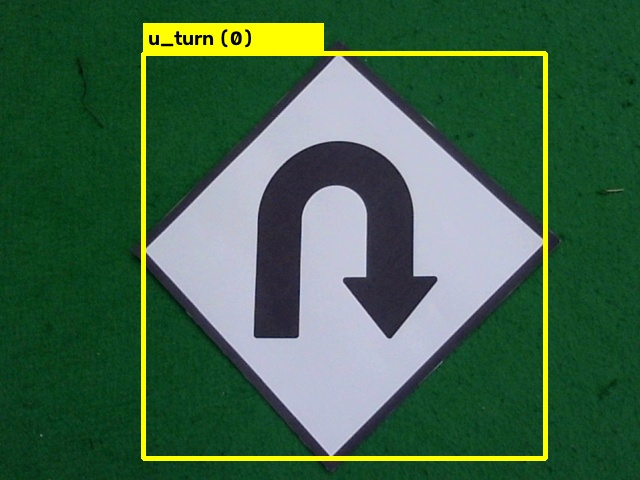
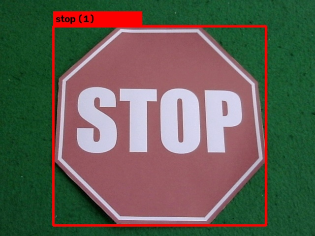
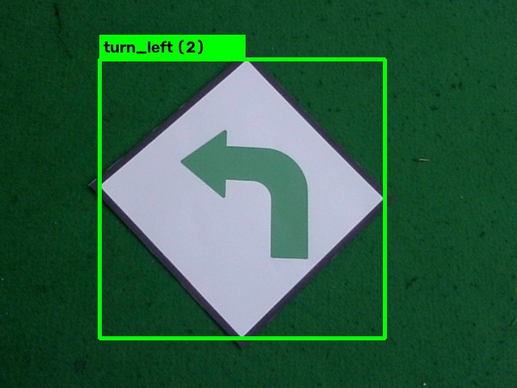
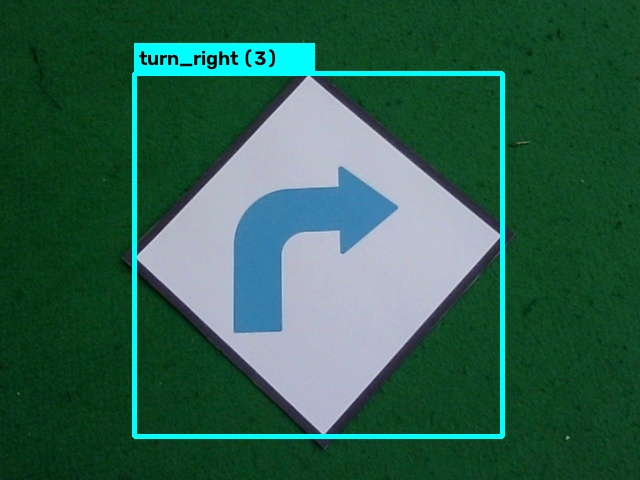

# Bounding Box Labeling Verification

Dokumen ini berisi sampel visualisasi koordinat bounding box format YOLO yang digambar secara presisi untuk 1 sampel dari masing-masing kelas rambu.

---

## 1. Class 0: U-Turn (`u_turn1.jpg`)

- File Sumber: `result/raw/u_turn/u_turn1.jpg`
- File Label: `result/label/u_turn/u_turn1.txt`
- Koordinat YOLO: `0 0.539062 0.532292 0.628125 0.843750`

---

## 2. Class 1: STOP (`stop1.jpg`)

- File Sumber: `result/raw/stop/stop1.jpg`
- File Label: `result/label/stop/stop1.txt`
- Koordinat YOLO: `1 0.507812 0.532292 0.675000 0.843750`

---

## 3. Class 2: Turn Left (`turn_left1.jpg`)

- File Sumber: `result/raw/turn_left/turn_left1.jpg`
- File Label: `result/label/turn_left/turn_left1.txt`
- Koordinat YOLO: `2 0.467969 0.512500 0.551562 0.720833`

---

## 4. Class 3: Turn Right (`turn_right1.jpg`)

- File Sumber: `result/raw/turn_right/turn_right1.jpg`
- File Label: `result/label/turn_right/turn_right1.txt`
- Koordinat YOLO: `3 0.497656 0.531250 0.573438 0.754167`

